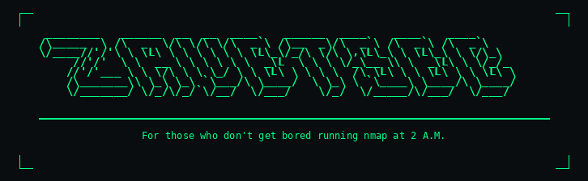

<div align="center">
  
</div>

<div align="center">

**Anonymous SOC/DFIR toolsmith. Single-file defensive tooling for air-gapped, incident response, and hardened environments.**

`No install. No dependencies. No agents. No telemetry.`


</div>

---

## Why ZavetSec

- Single-file execution — one script, run and done
- No installation, no prerequisites, no admin infrastructure
- Air-gap friendly — works fully offline
- MITRE ATT&CK aligned — findings mapped to tactics and techniques
- Dark HTML reporting — structured, self-contained, ready to share

---

## Tools

### SOC / DFIR / Hardening

| Tool | Platform | Capability |
|------|----------|------------|
| [**Invoke-ZavetSecTriage**](https://github.com/zavetsec/Invoke-ZavetSecTriage) | Windows / PS 5.1 | `DFIR triage • 17 modules • MITRE ATT&CK` |
| [**ZavetSec-Harden**](https://github.com/zavetsec/ZavetSec-Harden) | Windows / PS 5.1 | `Hardening baseline • CIS / DISA STIG • Audit / Apply / Rollback` |
| [**ZLT**](https://github.com/zavetsec/ZLT) | Linux / Bash | `Linux triage • 12 modules • single command` |
| [**Invoke-ADSecurityAudit**](https://github.com/zavetsec/Invoke-ADSecurityAudit) | Windows / PS 5.1 | `Active Directory audit • findings • remediation` |
| [**ZavetSec-NetworkInventory**](https://github.com/zavetsec/ZavetSec-NetworkInventory) | Windows / PS 5.1 | `Network scanner • asset inventory • offline` |
| [**ZavetSec-NetworkConnections**](https://github.com/zavetsec/ZavetSec-NetworkConnections) | Windows / PS 5.1 | `Live connections • GeoIP • process context • risk` |
| [**ZavetSec-BrowserHistory**](https://github.com/zavetsec/ZavetSec-BrowserHistory) | Windows / PS 5.1 | `Browser forensics • all users • all browsers` |
| [**Invoke-MBHashCheck**](https://github.com/zavetsec/Invoke-MBHashCheck) | Windows / PS 5.1 | `Hash lookup • MalwareBazaar • ThreatFox` |
| [**ZavetSec-Vault**](https://github.com/zavetsec/ZavetSec-Vault) | Any browser | `Offline password manager • AES-256-GCM • no cloud` |

### Personal Security & Privacy

| Tool | Platform | Capability |
|------|----------|------------|
| [**opsec-checklist**](https://github.com/zavetsec/opsec-checklist) | Any browser | `OPSEC assessment framework • 70+ items • RU/CIS + US/EU editions` |

---

## Design Standard

All tools share a consistent output format:

- `#0a0d10` dark background — readable in SOC environments at 3 AM
- `#00ff88` green accent — high contrast, low eye strain
- **JetBrains Mono** for code and data, **Rajdhani** for headers
- Severity tag badges, MITRE ATT&CK references inline
- 100% self-contained HTML — one file, no CDN, no external requests

---

## Coverage

```
Windows Triage        Invoke-ZavetSecTriage
Linux Triage          ZLT
Active Directory      Invoke-ADSecurityAudit
Network Discovery     ZavetSec-NetworkInventory
Live Connections      ZavetSec-NetworkConnections
Browser Forensics     ZavetSec-BrowserHistory
Hash Intel            Invoke-MBHashCheck
Hardening             ZavetSec-Harden
Secure Storage        ZavetSec-Vault
Personal OPSEC        opsec-checklist
```

---

<div align="center">

*Built for defenders. Designed for real-world operations.*  
*MIT Licensed — open, practical, unrestricted.*

</div>
